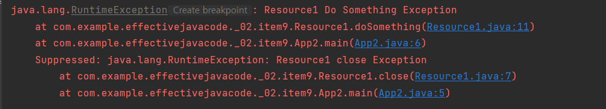

# 아이템9 - try-finally 보다는 try-with-resources를 사용하라

- 자바 라이브러리에는 close 메소드를 호출해 직접 닫아줘야 하는 자원이 많다. 
- 자원 닫기는 클라이언트가 놓치기 쉬워서 예측할 수 없는 성능 문제로 이어지기도 한다. 

### 전통적인 수단 try-finally

전통적으로 자원이 제대로 닫힘을 보장하는 수단으로 try-finally가 쓰였다. 

```java
public class Resource1 implements AutoCloseable{
    @Override
    public void close() {
        System.out.println("Resource1 close");
        throw new RuntimeException("Resource1 close Exception");
    }
    public void doSomething(){
        System.out.println("Resource1 Do Something");
        throw new RuntimeException("Resource1 Do Something Exception");
    }
}

public class Resource2 implements AutoCloseable{
    @Override
    public void close(){
        System.out.println("Resource2 close");
        throw new RuntimeException("Resource2 close Exception");
    }
    public void doSomething(){
        System.out.println("Resource2 Do Something");
        throw new RuntimeException("Resource2 Do Something Exception");
    }
}
```

try-finally 단점1 - 코드가 가독성이 떨어진다.
```java
public class App {
    public static void main(String[] args) {
        Resource1 resource1 = new Resource1();
        try {
            resource1.doSomething();
            Resource2 resource2 = null;
            try {
                resource2 = new Resource2();
                resource2.doSomething();
            }
            finally {
                if(resource2 != null){
                    resource2.close();
                }
            }
        }
        finally {
            resource1.close();
        }
    }
}
```
- 가독성만 떨어지면 다행이지만 그로 인해서 훌륭한 프로그래머들도 실수를 많이 하게 된다. 

try-finally 단점2 - 디버깅 어려움 
```java
public class App {
    public static void main(String[] args) {
        Resource1 resource1 = new Resource1();
        try {
            resource1.doSomething();
            Resource2 resource2 = null;
            try {
                resource2 = new Resource2();
                resource2.doSomething();
            }
            finally {
                if(resource2 != null){
                    resource2.close();
                }
            }
        }
        finally {
            resource1.close();
        }
    }
}
```
- 현재 코드를 돌리면  resource1.doSomething() 에서 예외를 던지기 때문에 바로 finally 문으로 오게된다. 
- 그러면 resource1.close()를 실행하는데 여기서 또다시 예외를 던진다.
- 내가 기대하는 출력문은 처음 finally문으로 오게 된 원인인 doSomething()부터 close()에서 발생한 예외까지 모두
  출력되게 하는 것이었다.
- 하지만 실제 출력은 close()에서의 예외만 나온다.
- 이런 출력은 디버깅에 많은 어려움을 준다. 


### 자바 7에 등장한 try-with-resources

```java
public class App2 {
    public static void main(String[] args) {
        try (Resource1 resource1 = new Resource1()){
            resource1.doSomething();
            // 명시적으로 close 호출하지 않아도 호출 
        }
    }
}
```
- try-finally 코드에 비해서 엄청 간단하다.
- 이 구조를 사용하려면 AutoCloseable 인터페이스를 구현해야 한다. 
- 단순하게 void를 반환하는 close 메소드 하나만 있는 인터페이스이다.


- Do Something에서 발생한 예외와 close 에서 발생한 예외 모두 잘 출력된다. 


### 정리 

- 꼭 회수해야 하는 자원을 다룰 때는 try-finally 말고, try-with-resources를 사용하자.
- 코드는 더 짧고 분명해지고, 만들어지는 예외 정보도 누락이 없다. 


